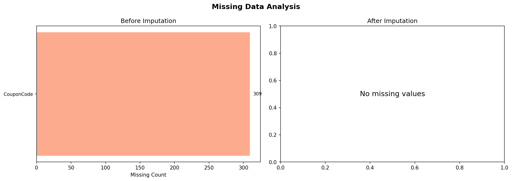
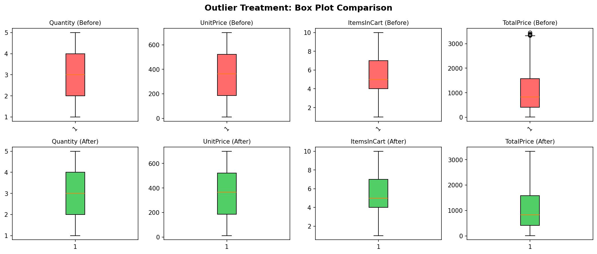
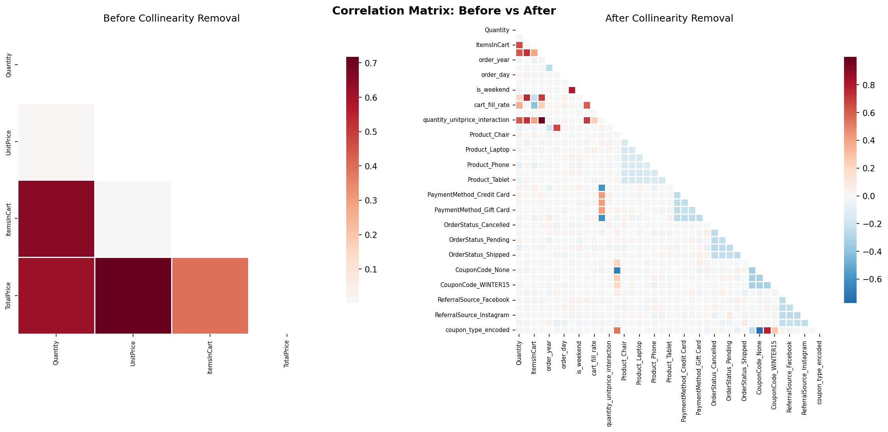
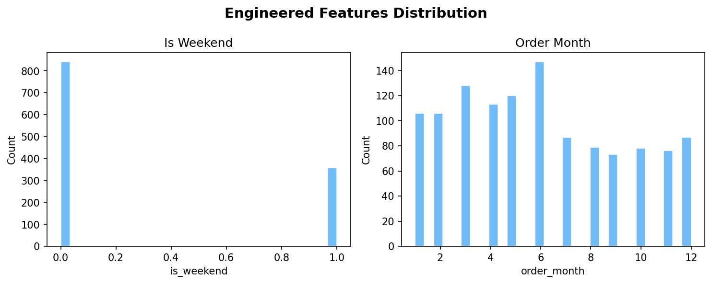
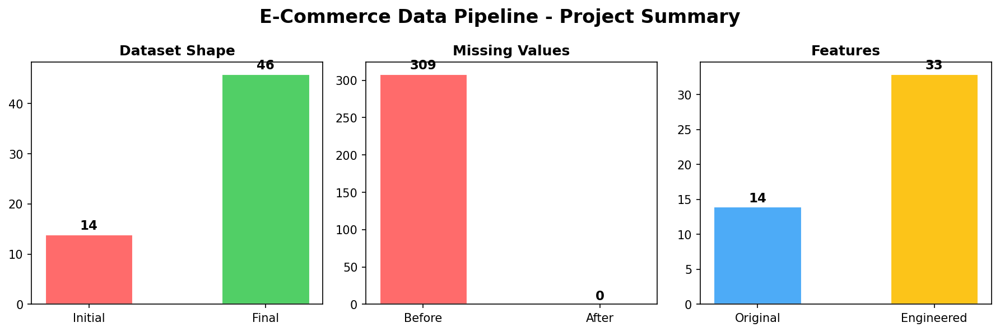

# 📊 E-Commerce Data Analytics Pipeline

**Production-Grade Data Pipeline — Input → Process → Output Architecture**

[](https://python.org)
[](https://pandas.pydata.org)
[](https://numpy.org)
[](https://scikit-learn.org)
[](https://matplotlib.org)
[](https://seaborn.pydata.org)

---

## 📋 Overview

A **production-grade data engineering pipeline** that transforms raw e-commerce order data into a mathematically clean, analysis-ready dataset. Built following the **Input-Process-Output (IPO)** blueprint — the same architecture used in enterprise feature stores and MLOps systems.

The pipeline ingests 1,200 e-commerce orders, handles missing values via intelligent imputation, neutralizes outliers using IQR-based winsorization, engineers over 10 new predictive features, encodes categorical variables, eradicates multicollinearity, and generates formal data contracts for downstream consumers.

Built for the **DecodeLabs Data Science** industrial training program.

---

## 📸 Pipeline Visualizations

| Before vs After |
|:---:|
| **Missing Data Analysis** |
|  |
| **Outlier Treatment Comparison** |
|  |
| **Correlation Matrix Before/After Collinearity Removal** |
|  |
| **Engineered Features Distribution** |
|  |
| **Pipeline Impact Summary** |
|  |

---

## ✨ Features

- **🧹 Intelligent Missing Data Handling** — Decision matrix-based imputation (mode, constant, KNN) based on missingness proportion
- **📐 IQR Outlier Treatment** — Non-parametric boundary detection with winsorization (preserves row count)
- **🧠 10+ Engineered Features** — Date-based features, coupon indicators, revenue ratios, payment type flags, interaction terms
- **🏷️ Categorical Encoding** — One-Hot, Binary, and Ordinal encoding with no synthetic spatial hierarchy
- **🔗 Multicollinearity Eradication** — Pearson correlation with target-aware feature selection (r > 0.80 threshold)
- **📋 Formal Data Contracts** — Schema validation, statistical boundary checks, point-in-time correctness verification
- **📊 Pipeline Visualizations** — Before/after comparison plots for missing data, outliers, correlations, and engineered features

---

## 🗂️ Project Structure

```
Ecommerce-Data-Analytics-Pipeline/
├── 📁 data/
│   └── ecommerce_data.xlsx          # Raw e-commerce dataset (1,200 rows, 14 cols)
├── 📁 src/
│   ├── phase1_input.py              # 🔵 INPUT: Missing imputation + outlier treatment
│   ├── feature_engineering.py        # 🟡 Feature creation (10+ new features)
│   ├── phase2_process.py            # 🟢 PROCESS: Encoding + collinearity eradication
│   ├── phase3_output.py             # 🟠 OUTPUT: Schema contracts + validation
│   ├── pipeline.py                  # 🔄 Pipeline orchestrator
│   └── visualize.py                 # 📈 Visualization generator
├── 📁 output/                       # Pipeline artifacts
│   ├── cleaned_dataset.csv          # Processed data (0 missing values)
│   ├── schema_report.csv            # Per-column dtype & missingness
│   ├── data_contract.csv            # Formal feature contracts
│   └── boundary_warnings.csv        # IQR boundary violations
├── 📁 figures/                      # Generated visualizations
│   ├── 01_missing_data.png
│   ├── 02_outlier_treatment.png
│   ├── 03_correlation_matrix.png
│   ├── 04_engineered_features.png
│   └── 05_pipeline_summary.png
├── main.py                          # Entry point
├── run.bat                          # VS Code launcher
├── requirements.txt
└── README.md
```

---

## 🚀 Quick Start

### Prerequisites

- Python 3.12+
- pip

### Setup

```bash
git clone https://github.com/abdur-codes/Ecommerce-Data-Analytics-Pipeline.git
cd Ecommerce-Data-Analytics-Pipeline

# Install dependencies
pip install -r requirements.txt

# Run the pipeline
python main.py
```

Or double-click `run.bat` to open in VS Code, then press **`Ctrl+Shift+B`**.

---

## 🧠 Pipeline Architecture

```
┌─────────────────────────────────────────────────────────────────────┐
│                       INPUT-PROCESS-OUTPUT (IPO)                    │
├───────────┬─────────────────────────┬───────────────────────────────┤
│  PHASE 1  │      PHASE 2            │         PHASE 3               │
│  INPUT    │      PROCESS            │         OUTPUT                │
├───────────┼─────────────────────────┼───────────────────────────────┤
│           │                         │                               │
│  Missing  │   One-Hot / Binary /    │   Schema Validation           │
│  Data     │   Ordinal Encoding      │   (dtypes, boundaries)        │
│  Matrix   │                         │                               │
│           │   Multicollinearity     │   Data Contract               │
│  IQR      │   Eradication           │   Generation                  │
│  Outlier  │   (target-aware         │                               │
│  Caps     │    Pearson, r>0.80)     │   Point-in-Time               │
│           │                         │   Leakage Check               │
│  KNN      │   Vectorized Ops        │                               │
│  Impute   │   (no loops)            │   Statistical                 │
│           │                         │   Boundary Checks             │
└───────────┴─────────────────────────┴───────────────────────────────┘
```

---

## 📊 Results

| Metric | Before | After |
|--------|--------|-------|
| **Dataset Shape** | 1,200 × 14 | 1,200 × **46** |
| **Missing Values** | 309 | **0** ✅ |
| **Features Engineered** | — | **10+** |
| **Coupon Missing %** | 25.75% | **0%** |

### Engineered Features

| Feature | Formula | Type |
|---------|---------|------|
| `order_year / month / day` | Extracted from Date | Temporal |
| `is_weekend` | `dayofweek >= 5` | Binary indicator |
| `had_coupon` | `CouponCode != 'None'` | Binary indicator |
| `coupon_type` | Normalized coupon label | Ordinal |
| `avg_item_price` | `TotalPrice / Quantity` | Normalized numeric |
| `price_per_cart_item` | `TotalPrice / ItemsInCart` | Normalized numeric |
| `cart_fill_rate` | `Quantity / ItemsInCart × 100` | Percentage |
| `is_card_payment` | Credit/Debit Card indicator | Binary indicator |
| `quantity_unitprice_interaction` | `Quantity × UnitPrice` | Cross-feature interaction |
| `month_coupon_interaction` | `order_month × had_coupon` | Cross-feature interaction |

---

## 🛠️ Tech Stack

| Layer | Technology |
|-------|-----------|
| **Language** | Python 3.12 |
| **Data Manipulation** | Pandas, NumPy |
| **Statistical Methods** | IQR, Winsorization, KNN Imputation (scikit-learn) |
| **Encoding** | One-Hot, Binary, Ordinal |
| **Validation** | Schema contracts, statistical boundary checks, leakage detection |
| **Visualization** | Matplotlib, Seaborn |

---

## 🔬 Key Techniques

### Missing Data Decision Matrix
```
Missing < 5%   → Mode imputation (categorical) / Median (numeric)
5-20%          → Mode imputation (categorical) / Median (numeric)
> 20%          → KNN Imputation (numeric) / Constant 'None' (categorical)
```

### Outlier Treatment
- **Method:** Interquartile Range (IQR) — Q1 − 1.5×IQR to Q3 + 1.5×IQR
- **Strategy:** Winsorization (`numpy.clip`) — preserves row count for temporal integrity

### Multicollinearity Eradication
1. Build absolute Pearson correlation matrix
2. Extract upper triangle (r > 0.80 threshold)
3. For each collinear pair, compare correlation with target variable
4. Drop the feature with weaker target correlation

---

## 🤝 Connect

[](https://github.com/abdur-codes)
[](https://linkedin.com/in/abdur-codes)

**If you find this project useful, consider giving it a ⭐!**

---

**DecodeLabs** — Data Science Industrial Training — Batch 2026
